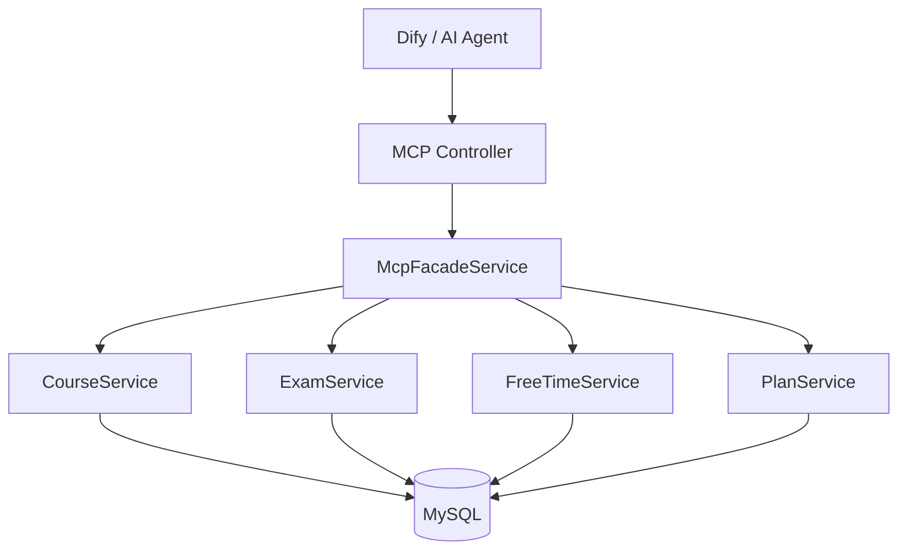

# Smart Study Scheduler

智能学习任务调度系统后端，面向 Dify / AI Agent 的 MCP 中间层服务。

## 技术栈

- Java 21
- Spring Boot 3.4
- Spring Data JPA
- MySQL 8
- MapStruct / Lombok / Hutool
- springdoc-openapi (Swagger UI)
- Docker Compose

## 项目架构

```text
com.scheduler
├── common          # Result、异常、枚举、常量
├── config          # Jackson、OpenAPI、日志、配置属性
├── infrastructure  # 基础持久化能力
└── modules
    ├── course      # 课程
    ├── exam        # 考试
    ├── schedule    # 时间槽与空闲时间算法
    ├── plan        # 学习计划
    ├── user        # 用户（预留扩展）
    └── mcp         # 对外 MCP API 聚合
```




## 启动方式

### 前置条件

- JDK 21
- Maven 3.9+
- MySQL 8（本地或 Docker）

### 本地启动（连接云 MySQL）

开发环境默认连接云服务器 **`1.94.210.192:3306`**，配置见 `application-dev.yml`。

1. 在云服务器 MySQL 中创建库（若尚未创建）：

```sql
CREATE DATABASE smart_scheduler DEFAULT CHARACTER SET utf8mb4;
```

2. 确认云 MySQL 已放行你本机 IP（安全组 / 防火墙开放 **3306**，且 `bind-address` 允许远程连接）。

3. 按需修改 `application-dev.yml` 中的账号密码（当前默认 `root` / `123456`），或通过环境变量覆盖：

```powershell
$env:DB_HOST="1.94.210.192"
$env:DB_USERNAME="root"
$env:DB_PASSWORD="你的密码"
$env:SPRING_SQL_INIT_MODE="always"   # 仅首次需要建表+种子数据，之后可设为 never
.\mvnw.cmd spring-boot:run
```

4. 启动应用：

```bash
.\mvnw.cmd spring-boot:run
```

应用默认端口：`50060`（见 `application.yml`），Profile：`dev`（首次启动会自动执行 `db/schema.sql` 与 `db/data.sql`）。

### Docker 启动

```bash
docker compose up -d --build
```

- MySQL：`localhost:3306`，库名 `smart_scheduler`
- 应用：`http://localhost:50060`（本地与 Docker 均为 **50060**）

## 云 MySQL 检查清单

| 项 | 说明 |
|----|------|
| 库名 | `smart_scheduler` |
| 地址 | `1.94.210.192:3306` |
| 远程访问 | `GRANT ALL ON smart_scheduler.* TO 'root'@'%' IDENTIFIED BY '密码'; FLUSH PRIVILEGES;` |
| 防火墙 | 云安全组入站放行 3306 |
| 初始化 | 首次 `SPRING_SQL_INIT_MODE=always`，表与数据就绪后改为 `never` |
| 空闲断连 | 已配置 Hikari `keepalive-time` / `max-lifetime`；若仍报错请重启应用 |

## 数据库初始化（mysql -u root -p）

- 表结构：`src/main/resources/db/schema.sql`
- 模拟数据：`src/main/resources/db/data.sql`

包含 6 门软件工程专业相关课程（含别名、教师、地点、时间槽）、4 场相关考试、5 条学习计划及资源链接。

## 接口文档

完整 MCP API 说明见：**[API_README.md](./API_README.md)**

- Swagger UI：[http://localhost:50060/swagger-ui.html](http://localhost:50060/swagger-ui.html)
- OpenAPI JSON：[http://localhost:50060/v3/api-docs](http://localhost:50060/v3/api-docs)

## 环境配置


| Profile | 文件                   | 说明                      |
| ------- | -------------------- | ----------------------- |
| dev     | application-dev.yml  | 本地开发，自动初始化 SQL          |
| test    | application-test.yml | 测试环境                    |
| prod    | application-prod.yml | 生产 / Docker，通过环境变量配置数据源 |


## 扩展预留

- `user` 模块：RBAC、多用户排程
- `mcp` 聚合层：便于接入 Dify Tool、LangChain4j
- 空闲时间算法：`TimeIntervalMerger` 可扩展日历同步、通知推送

## 许可证

课程作业 / 教学用途。